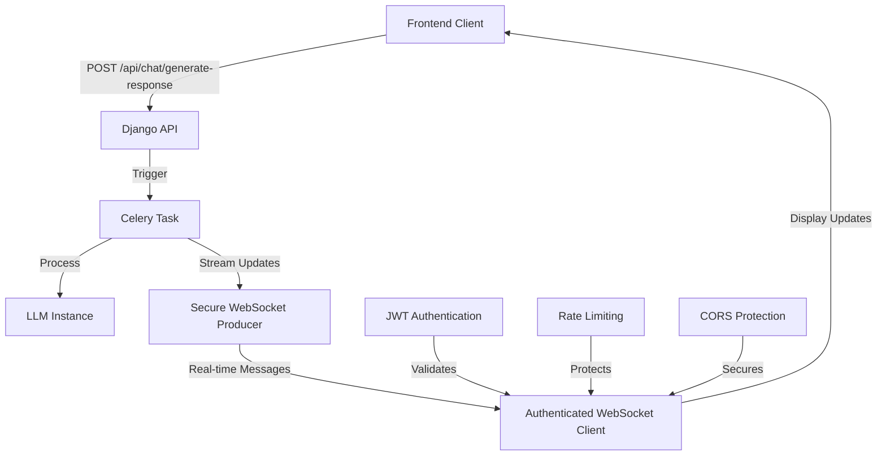

# 🔒 Secure WebSocket Implementation

## Quick Start

Your LLM response streaming system uses a **secure producer-only WebSocket architecture**:



## 🔐 Security Features Implemented

### 1. **JWT Authentication Required** ✅

```javascript
// Frontend connects with JWT token
const token = localStorage.getItem("access_token");
const socket = new WebSocket(
  `ws://localhost:8000/ws/frame-stream/user_123/?token=${token}`
);
```

### 2. **Authorization Validation** ✅

```python
# Server validates user can only access their own channel
if str(authenticated_user.user_id) != url_user_id:
    await self.close(code=4003)  # Forbidden
```

### 3. **Rate Limiting** ✅

```python
# Max 3 concurrent connections per user
# Connection timeout after 2 hours
# Automatic connection tracking
```

### 4. **Producer-Only Design** ✅

```python
# WebSocket ONLY accepts:
# - ping/pong for health checks
# - heartbeat messages
# - Rejects all other client messages
```

### 5. **CORS Protection** ✅

```python
# Validates origin header
# Allows only configured domains
# Prevents cross-site WebSocket attacks
```

## 🚀 Message Flow

### 1. Client Initiates Request

```bash
POST /api/chat/generate-response/
{
    "user_id": "user_123",
    "chat_id": "chat_456",
    "prompt": "Hello, how are you?"
}
```

### 2. Celery Task Processes Request

```python
# Task starts and sends status updates via WebSocket
streamer = FrameStreamer(user_id, chat_id)
streamer.notify_task_started(prompt)
streamer.notify_llm_thinking()

# LLM generates response
response = llm_instance.chat(prompt)

# Final response sent via WebSocket
streamer.notify_task_completed(response)
```

### 3. Frontend Receives Real-time Updates

```javascript
socket.onmessage = (event) => {
  const data = JSON.parse(event.data);

  switch (data.type) {
    case "llm_status":
      updateStatus(data.status, data.message);
      break;
    case "llm_frame":
      updateProgress(data.frame);
      break;
    case "llm_response":
      displayFinalResponse(data.data);
      break;
    case "llm_error":
      showError(data.error);
      break;
  }
};
```

## 📋 WebSocket Message Types

### Status Messages

```json
{
  "type": "llm_status",
  "user_id": "user_123",
  "chat_id": "chat_456",
  "status": "started|processing|thinking|streaming|completed|failed",
  "message": "Processing prompt: Hello, how are you?...",
  "timestamp": "2025-11-04T10:30:00Z"
}
```

### Frame Updates (Progress)

```json
{
  "type": "llm_frame",
  "user_id": "user_123",
  "chat_id": "chat_456",
  "frame": {
    "status": "thinking",
    "message": "LLM is generating response...",
    "progress": "indeterminate"
  },
  "timestamp": "2025-11-04T10:30:01Z"
}
```

### Final Response

```json
{
  "type": "llm_response",
  "user_id": "user_123",
  "chat_id": "chat_456",
  "data": {
    "event": "response_generated",
    "user_id": "user_123",
    "chat_id": "chat_456",
    "response": "Hello! I'm doing well, thank you for asking...",
    "model": "gpt-4",
    "timestamp": "2025-11-04T10:30:05Z"
  },
  "timestamp": "2025-11-04T10:30:05Z"
}
```

### Error Notifications

```json
{
  "type": "llm_error",
  "user_id": "user_123",
  "chat_id": "chat_456",
  "error": "LLM processing failed: API rate limit exceeded",
  "timestamp": "2025-11-04T10:30:02Z"
}
```

### System Messages

```json
{
  "type": "system",
  "status": "connected",
  "message": "WebSocket connection established",
  "timestamp": "2025-11-04T10:29:58Z"
}
```

## 🔧 Implementation Files

### Core Components

- **`consumers.py`** - Secure WebSocket consumer with authentication
- **`frameStreamer.py`** - Producer-only message streamer
- **`tasks.py`** - Updated Celery task with secure streaming
- **`routing.py`** - WebSocket URL routing

### Security Components

- **`secure_consumers.py`** - Advanced security features
- **`websocket_security_settings.py`** - Security configuration
- **`WEBSOCKET_SECURITY.md`** - Comprehensive security guide

## 📱 Frontend Integration

### JavaScript WebSocket Client

```javascript
class SecureLLMWebSocket {
  constructor(userId, accessToken) {
    this.userId = userId;
    this.token = accessToken;
    this.socket = null;
    this.callbacks = {};
  }

  connect() {
    const wsUrl = `ws://localhost:8000/ws/frame-stream/${this.userId}/?token=${this.token}`;

    this.socket = new WebSocket(wsUrl);

    this.socket.onopen = () => {
      console.log("✅ Secure WebSocket connected");
      this.sendHeartbeat();
    };

    this.socket.onmessage = (event) => {
      const data = JSON.parse(event.data);
      this.handleMessage(data);
    };

    this.socket.onclose = (event) => {
      if (event.code === 4001) {
        console.error("❌ Authentication failed");
        this.onAuthError();
      } else if (event.code === 4003) {
        console.error("❌ Authorization denied");
        this.onAuthError();
      }
    };
  }

  handleMessage(data) {
    switch (data.type) {
      case "llm_status":
        this.onStatusUpdate(data.status, data.message);
        break;
      case "llm_frame":
        this.onFrameUpdate(data.frame);
        break;
      case "llm_response":
        this.onFinalResponse(data.data);
        break;
      case "llm_error":
        this.onError(data.error);
        break;
    }
  }

  sendHeartbeat() {
    if (this.socket?.readyState === WebSocket.OPEN) {
      this.socket.send(
        JSON.stringify({
          type: "heartbeat",
        })
      );
    }
  }

  // Override these methods in your implementation
  onStatusUpdate(status, message) {
    /* Update UI status */
  }
  onFrameUpdate(frame) {
    /* Update progress */
  }
  onFinalResponse(data) {
    /* Display response */
  }
  onError(error) {
    /* Show error */
  }
  onAuthError() {
    /* Handle auth failure */
  }
}
```

### React Integration Example

```jsx
import { useState, useEffect, useRef } from "react";

function LLMChat({ userId, accessToken }) {
  const [messages, setMessages] = useState([]);
  const [status, setStatus] = useState("disconnected");
  const wsRef = useRef(null);

  useEffect(() => {
    // Initialize secure WebSocket
    const ws = new SecureLLMWebSocket(userId, accessToken);

    ws.onStatusUpdate = (status, message) => {
      setStatus(status);
      console.log(`Status: ${status} - ${message}`);
    };

    ws.onFinalResponse = (data) => {
      setMessages((prev) => [
        ...prev,
        {
          type: "assistant",
          content: data.response,
          timestamp: data.timestamp,
        },
      ]);
      setStatus("completed");
    };

    ws.onError = (error) => {
      console.error("LLM Error:", error);
      setStatus("error");
    };

    ws.connect();
    wsRef.current = ws;

    return () => {
      ws.socket?.close();
    };
  }, [userId, accessToken]);

  const sendMessage = async (prompt) => {
    // Send via REST API (not WebSocket)
    const response = await fetch("/api/chat/generate-response/", {
      method: "POST",
      headers: {
        Authorization: `Bearer ${accessToken}`,
        "Content-Type": "application/json",
      },
      body: JSON.stringify({
        user_id: userId,
        chat_id: "current_chat",
        prompt: prompt,
      }),
    });

    if (response.ok) {
      setStatus("processing");
      setMessages((prev) => [
        ...prev,
        {
          type: "user",
          content: prompt,
          timestamp: new Date().toISOString(),
        },
      ]);
    }
  };

  return (
    <div className="llm-chat">
      <div className="status">Status: {status}</div>
      <div className="messages">
        {messages.map((msg, idx) => (
          <div key={idx} className={`message ${msg.type}`}>
            {msg.content}
          </div>
        ))}
      </div>
      {/* Chat input component */}
    </div>
  );
}
```

## 🚦 Connection States & Error Handling

### WebSocket Connection Codes

- **1000** - Normal closure
- **4000** - Bad Request (missing user_id)
- **4001** - Unauthorized (invalid/missing JWT)
- **4003** - Forbidden (user_id mismatch)
- **4429** - Too Many Requests (rate limited)

### Error Recovery

```javascript
class RobustWebSocket {
  constructor(url, options = {}) {
    this.url = url;
    this.options = options;
    this.reconnectAttempts = 0;
    this.maxReconnectAttempts = 5;
    this.reconnectDelay = 1000;
  }

  connect() {
    try {
      this.socket = new WebSocket(this.url);
      this.setupEventHandlers();
    } catch (error) {
      this.handleConnectionError(error);
    }
  }

  handleConnectionError(error) {
    if (this.reconnectAttempts < this.maxReconnectAttempts) {
      setTimeout(() => {
        this.reconnectAttempts++;
        console.log(`Reconnect attempt ${this.reconnectAttempts}`);
        this.connect();
      }, this.reconnectDelay * Math.pow(2, this.reconnectAttempts));
    } else {
      console.error("Max reconnection attempts reached");
      this.onMaxReconnectAttemptsReached();
    }
  }
}
```

## 🔒 Security Best Practices

### 1. Token Management

- Store JWT securely (httpOnly cookies recommended)
- Refresh tokens before expiration
- Handle token refresh in WebSocket reconnections

### 2. Connection Security

- Always use WSS (WebSocket Secure) in production
- Validate origin headers
- Implement proper CORS policies

### 3. Rate Limiting

- Monitor connection patterns
- Implement exponential backoff for reconnections
- Set reasonable message frequency limits

### 4. Error Handling

- Never expose internal errors to clients
- Log security events appropriately
- Implement graceful degradation

## 🚀 Deployment Checklist

### Development Environment

- [x] JWT authentication implemented
- [x] Rate limiting configured
- [x] CORS protection enabled
- [x] Error handling implemented
- [ ] SSL/TLS certificates (for WSS)

### Production Environment

- [ ] Enable HTTPS/WSS everywhere
- [ ] Configure production origins in CORS
- [ ] Set up proper logging and monitoring
- [ ] Implement health checks
- [ ] Configure load balancer for WebSocket support
- [ ] Set up Redis cluster for scaling

## 📊 Monitoring & Analytics

### WebSocket Metrics to Track

- Connection count per user
- Message throughput
- Authentication failure rate
- Connection duration
- Error rates by type

### Logging Example

```python
# In your application
logger.info(f"WebSocket connection established: user={user_id}, ip={client_ip}")
logger.warning(f"Rate limit exceeded: user={user_id}, limit=60/min")
logger.error(f"Authentication failed: invalid_token from {client_ip}")
```

This secure producer-only WebSocket architecture ensures that your LLM response streaming is both secure and efficient, providing real-time updates to authenticated clients while protecting against common WebSocket vulnerabilities.
